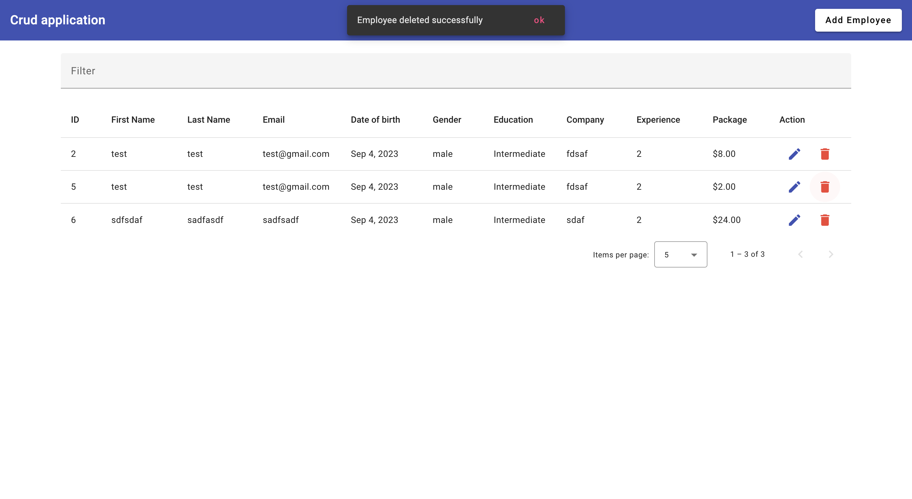

# Angular CRUD App

This is a simple CRUD (Create, Read, Update, Delete) web application built using Angular. It allows you to manage employee data, including adding, viewing, editing, and deleting employee records.

## Table of Contents

- [Features](#features)
- [Prerequisites](#prerequisites)
- [Getting Started](#getting-started)
- [Usage](#usage)
- [Project Structure](#project-structure)
- [Contributing](#contributing)
- [License](#license)

## Features

- **Create:** Add new employee records.
- **Read:** View a list of employees and their details.
- **Update:** Edit employee information.
- **Delete:** Remove employee records from the system.

## Prerequisites

Before you begin, ensure you have met the following requirements:

- **Node.js and npm:** Make sure you have Node.js and npm (Node Package Manager) installed on your development machine.

  To check if you have them installed, open your terminal and run:

  ```bash
  node -v
  npm -v
  ```

## Getting Started

To get started with this project, follow these simple steps.
Clone or download the repository to your local machine using `https://github.com/Yonis7/crud_app`
Install all dependencies by running command in root folder :

```bash
npm install
```

Run development server on port 4200 (default):

```bash
ng serve --open=true
```

Navigate to http://localhost:4200/. The app will automatically reload if you change any of the source files.

### Usage

This is an example usage for create action:


This is an example usage for read action:


This is an example usage for the update action:


This is an example usage for delete action:


## Project Structure

Within the download you'll find the following directories and files:

```
├── README.md
├── angular-cli.json          # Angular CLI configuration file
├── e2e                        # End-to-end tests directory
│   ├── protractor.conf.js     # Protractor config file
│   └── tsconfig.e2e.json      # TypeScript configuration file
├── karma.conf.js             # Karma config file
├── package.json              # Node modules dependency list
├── src                       # Source code directory
│   ├── assets                # Assets like images etc...
|   |    ├── css               # CSS stylesheets used across application
|   |    │  └── styles.css
|   |    └── fonts            # Fonts used throughout application
|   |        └── ...           # Font files (.ttf,.woff...)
│   ├── environments          # Environment specific configurations
│   │   └── environment.ts       # Default enviroment settings
│   ├── favicon.ico           # Fav icon image
│   ├── index.html            # Main HTML page container component
│   ├── main.ts               # Entry point into our program, where we bootstrap components
│   ├── polyfills.ts          # Polyfill needed by Angular
│   ├── test.ts               # Unit testing entrypoint - load all unit tests here
│   ├── tsconfig.app.json     # App level TypeScript configuration options
│   ├── typings.d.ts         # Typings that are global in scope but not included with library distribution
│   └── vendor.ts             # Vendor libraries imported through script tags
├── .angular-cli.json         # Angular CLI configuration file
├── bower.json                 # Bower dependencies (not installed when using npm install)
├── gulpfile.babel.js          # Gulp build tasks
├── LICENSE                    # License information about this project
└── tslint.json                # TSLint rules for linting TypeScript
```

## Contributing

Pull requests are welcome! For major changes please open a new issue first to discuss what you would like to change. Please make sure to update tests as

1. Fork it!
2. Create your feature branch: `git checkout -b my-new-feature`
3. Commit your changes: `git commit -am 'Add some feature'`
4. Push to the branch: `git push origin my-new-feature`
5. Submit a pull request :D

## Licence

Github.com/Yonis7
